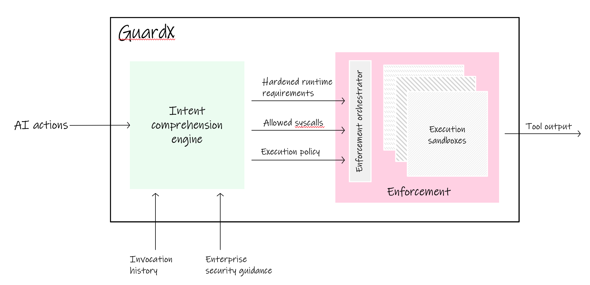

=========
Overview
=========

Applications can rely on AI to execute AI-generated code snippets on the fly, to parse documents, json blobs or perform specific computations. The code generated for these purposes is susceptible to the following issues.

 * May rely on old or unsafe program libraries
 * Contain malicious code snippets
 * Extraneous functionality (e.g., write a result to disk or remote network connection when not needed)
 * Syntax and semantic errors
 * Contain embedded passwords or secret tokens
 * Use bad coding practices, high cyclomatic complexity or overall bad quality

GuardX is designed to mitigate such threats. More specifically GuardX aims to mitigate these threats for the use cases shown below:

* **Execution at inference:**
  Increase power of inference by securely executing code during inference to generate complex results

* **Actions for agents:**
  Allow agent workflow actions to securely invoke APIs and code

* **Better, safer training:**
  Fine tune models without worrying about bad code, keys or secrets being embedded in the model

Further, GuardX is designed with the following performance goals.

* **Integrate quickly:**
  GuardX library allow projects to secure execution without worrying about the "how"

* **Configurability:**
  GuardX library allow users to pick and choose the level of enforcement and guardrails as applicable to their environmental needs

Architecture 
=============

GuardX can be used to create pipelines that analyze and filter code generated by GenAI code models, and for guarding the execution of generated code. Conceptually this is done in two phases.

1. Analysis
-----------

GuardX analyzes AI generated code snippets using:

  * Code scanning and analysis tools (detect-secrets, bandit, etc.)
  * Perform syscall analysis to identify code privilege requirements to detect inappropriate actions
  * Perform AI infused “intent” detection (for invocation, prompts or code) to guide appropriate enforcement (future)
  * Route based on intent of action and policy, e.g., route to TEE enabled platform for sensitive data flows or geo-restricted data centers (future) 
  * Apply flow-based analysis to uncover hidden threats that may not show up by independently analyzing individual actions (future)

* Intent profiles
  Based on syscall analysis of "similar code", GuardX will try to match the required permissions of the generated code snippet to a set of predefined intents

1. Execution
------------

Execution of AI generated code poses a high security risk for application users and data owners. To enable this GuardX orchestrates sand boxed containers or VMs (future). Containers can be sand boxed with seccomp policies which are derived from intent profiles. GuardX takes care of instantiating the execution environment, applying appropriate security profiles and verifying the output. 

